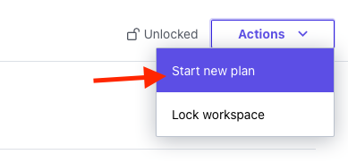
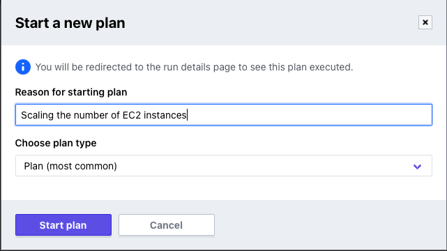

# Lab: Migrate Variables to Terraform Cloud

This lab demonstrates how to store variables to Terraform Enterprise.

Duration: 10 minutes

- Task 1: Migrate your variables to TFC
- Task 2: Run a plan locally
- Task 3: Change a variable
- Task 4: Run an apply remotely

This lab demonstrates how to store variables in Terraform Cloud.

## Task 1: Migrate your variables to TFC

Now that we have our state stored in Terraform Cloud in our workspace, we will take the next logical step and store our sensitive variables into TFC as well.

- In this step, we will be taking all of that variables and values that are stored locally in the `terraform.tfvars` file and migrating them up to Terraform Cloud.
- The first thing you will need to do is navigate to your Terraform Cloud `webserver-aws-dev` in the UI.
- Once there, navigate to the `Variables` tab.
  - 
- In the `Variables` tab, you can add variables related to the state file that was previously migrated.
- To do this, first selec the `+ Add variable` button
- Once you've done this, you can add a Key-Value pair for your variable, much like it is in your `terraform.tfvars` file.
- For example, if your `identity` for this class is `terraform-training-ant`, you would add `identity` to the `Key` field and `terraform-training-ant` fo the `Value` field.
- Do this for every variable in your `terraform.tfvars` file, **WITH THE FOLLOWING EXCEPTIONS:**
  - `secret_key` - For this variable, you can add the `Key` and `Value` fields as normal. However, since this is considered to be a sensitive value, we want to treat it as such. Select the radial button after the `Value` text box that says `Sensitive` to make sure that the value is obscured.
    - 
  - `vpc_security_group_ids` - As we previously discussed, the value for this variable is written out as a list. Because of this, it needs to be entered a bit differently.
    - the `Key` value can be entered as normal
    - the `Value` will be different. Instead of just taking the straight value as before, we will need to copy and past the entire thing including the brackets and quotes, e.g. `["sg-0cbbc51faf252a664"]`
    - Lastly, before saving, you must select the radial button that says `HCL` so that TFC knows how to properly interpolate the value of this variable
      - 
- After you've done all of this, your variables should look something like this:
  

### Step 13.1.3 - Comment out your variables in `terraform.tfvars`

- Variables declared and defined in Terraform Cloud will be parsed before values in a `terraform.tfvars` file.
- In your `terraform.tfvars` file, comment out every line of every variable
- Make sure that your file is saved.

## Task 2: Run a plan locally

### Step 13.2.1 - Run a terraform init

- Next reinitialize your terraform project locally and run a `terraform plan` to validate that refactoring your code to make use of variables within TFC did not introduce any planned infrastructure changes. This can be confirmed by validating a zero change plan.

```bash
terraform plan

Running plan in the remote backend. Output will stream here. Pressing Ctrl-C
will stop streaming the logs, but will not stop the plan running remotely.

Preparing the remote plan...

To view this run in a browser, visit:
https://app.terraform.io/app/Enterprise-Cloud/server-build/runs/run-DGXauYrWeB1xwwPx

Waiting for the plan to start...

Terraform v0.14.8
Configuring remote state backend...
Initializing Terraform configuration...
module.keypair.tls_private_key.generated: Refreshing state... [id=34a0559a16dc68108d30a76d9a5a7b25f8885e1e]
module.keypair.local_file.public_key_openssh[0]: Refreshing state... [id=0e346a51831a9bc96fd9ea142f8c35b4e1ade12b]
module.keypair.local_file.private_key_pem[0]: Refreshing state... [id=b7ac3f7125c4e3681fd38539b220c1abf01d1254]
module.keypair.null_resource.chmod[0]: Refreshing state... [id=1854006565944356631]
module.keypair.aws_key_pair.generated: Refreshing state... [id=terraform-nyl-ant-key]
module.server[0].aws_instance.web[1]: Refreshing state... [id=i-047d4d406e22e87f9]
module.server[1].aws_instance.web[0]: Refreshing state... [id=i-003fcdb877e575b26]
module.server[0].aws_instance.web[0]: Refreshing state... [id=i-0d16b6f6eda6b834e]
module.server[1].aws_instance.web[1]: Refreshing state... [id=i-03be3bf6ee29f5633]

No changes. Infrastructure is up-to-date.

This means that Terraform did not detect any differences between your
configuration and real physical resources that exist. As a result, no
actions need to be performed.
```

## Task 3: Change a Variable

Next, we will be testing to make sure that our variables in TFC are working correctly.

### Step 13.3.1 - Modify the server name by changing the `identity` variable in TFC

- Simply click on the `***` button to the right of your variables, and then select the `Edit` option
- Change the value of your `identity` variable and save to apply a new name to your server.
- Run a `terraform apply` locally in your code editor.
- When this is ran locally, you should see that Terraform is looking at the variable in TFC, and it will update your server tags with the `indentity` value.

## Task 4: Run an apply remotely

Now that we've tested that our configuration is still working and that our variables can be stored and manipulated withing Terraform Cloud, let's also test an apply within Terraform Cloud itself.

### Step 13.4.1 - Queue a plan in Terraform Cloud

Now that your variable value has changed, let's queue the plan in Terraform Cloud

- Navigate to the `Actions` box in the top right corner and choose `Start new plan`
  - 
- In the `Reason for starting plan` dialogue box, type something meaningful to your use case. For this, we can simply say `Updating Server Indentity`.
- In the `Choose plan type` option, make sure that `Plan (most common)` is selected
  - 
- Follow the dialogue boxes through this process. Review your plan to ensure that it will be doing exactly what you expect, and then confirm and apply when given the opportunity.

## Congratulations! You're now storing your variable definitions remotely and can control the behavior of your Terraform code by adjusting their values. With Terraform Cloud you are able to centralize and secure the variable definintions for your workspace.
